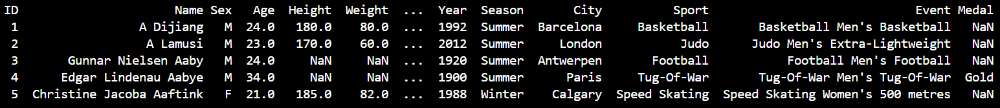

# Project Journal

## Activities B & C

### 2/06/2025
- Started Activities B & C
- Created ProjectJournal.md
- Updated README.md
- Created actB.py
- Created actC.py
- Completed Activities B & C
- Started Filtering, Sorting, Grouping

## Activity C Questions:
### Task 1 Questions:
1. 15
2. Name: Athlete Name, Sex: Athlete Biological Sex, Height: Athlete Height in CM
3. 

### Task 2 Questions:
1. Athletics, Gymnastics, Swimming, Shooting, Cycling
2. 196594 vs. 74522 (MvF)

### Task 3 Questions:
1. 25.5 years old
2. Oldest: 97yo, Youngest: 10yo
3. No

### Extension Questions:
URS = Soviet Union (USSR)
GDR = East Germany
FRG = West Germany

### Reflection Questions
1. A lot of data is collected every Olympic Games
2. Nil
3. Red Light + Speed Camera Output